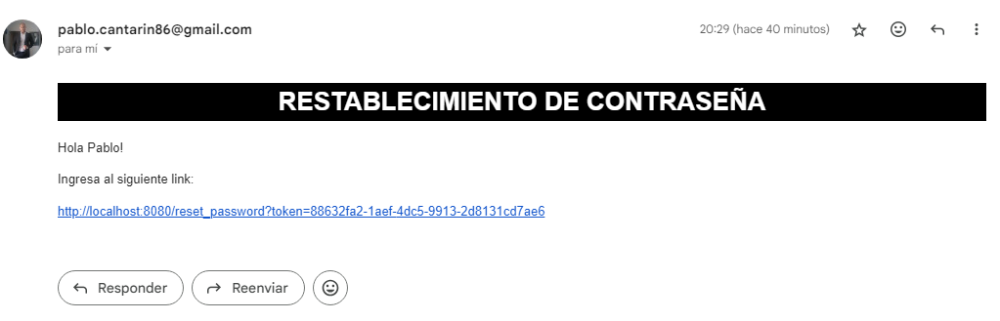

# TERCER PRACTICA INTEGRADORA

**CAMBIO DE CONTRASEÑA**

```
GET: http://localhost:8080/changepassword
```

Se solicita correo para enviar link con período de una hora de validez

---

```
POST: http://localhost:8080/changepassword
```

Se envía el correo a la casilla indicada en el input



Se utiliza una query para obtener el token generado y guardado en base de datos para su validez

Si link expira, reenvia devualta a GET: http://localhost:8080/changepassword

---

```
PUT: http://localhost:8080/changepassword
```

Se actualiza la contraseña solo si es difrenete a la almacenada en la base de datos

**ROLES PREMIUM, USER Y ADMIN**

Primero se debe loguear para poder acceder a:

```
GET: http://localhost:8080/productsManager
```

Si el rol es admin puede eliminar cualquier producto si es Premium solo los que él ha agregado.

**CAMBIO ROL DE USUARIO**

Solo el que tiene rol admin puede entrar a estos endpoints

```
GET: http://localhost:8080/api/users
```

Muestra todos los usuarios

---

```
GET: http://localhost:8080/api/users/premium/:uid
```

Muestra solo el usuario seleccionado

---

```
PUT: http://localhost:8080/api/users/premium/:uid
```

Cambia el rol si es user a premium y viceversa

En la vista de Product el usuario premium no puede agregar productos que le pertenezcan al carrito
